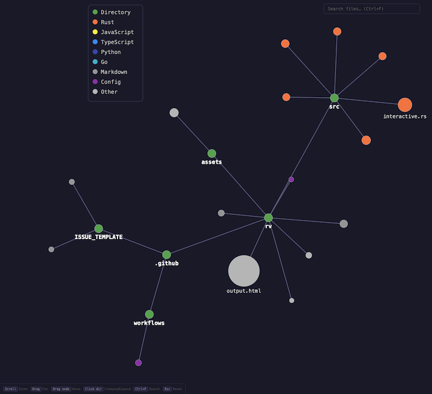

# rv

A Rust CLI tool that generates interactive, force-directed graph visualizations of directory structures.

## Project Structure



## Features

- **Interactive HTML output** (default) — Pan, zoom, search, hover tooltips, collapsible directories, and node dragging
- **Force-directed layout** — Organic node positioning using physics simulation
- **File size visualization** — Node sizes reflect file sizes
- **Color-coded file types** — Different colors for Rust, JavaScript, Python, Go, etc.
- **Smart filtering** — Automatically excludes build directories (node_modules, target, etc.)
- **Respects .gitignore** — Skips files ignored by git
- **Static SVG fallback** — Use `--no-interactive` for a plain SVG when needed

## Installation

```bash
# Clone the repository
git clone https://github.com/yourusername/rv.git
cd rv

# Build
cargo build --release

# Install globally (optional)
cargo install --path .
```

## Usage

```bash
rv [OPTIONS] [PATH]

Arguments:
  [PATH]  Directory to visualize [default: .]

Options:
  -o, --output <FILE>       Output file [default: output.html, or output.svg with --no-interactive]
  -W, --width <N>           SVG width in pixels [default: 1200]
  -H, --height <N>          SVG height in pixels [default: 800]
  -d, --max-depth <N>       Maximum directory depth to traverse
  -a, --all                 Include all directories (don't filter build dirs)
      --no-interactive       Disable interactive mode; output a static SVG instead
  -h, --help                Print help
```

### Examples

```bash
# Visualize current directory (interactive HTML)
rv

# Visualize a specific project
rv ~/projects/my-app -o my-app.html

# Output a static SVG instead
rv --no-interactive -o diagram.svg

# Include node_modules and other build directories
rv --all

# Limit depth for large projects
rv -d 3 -o shallow.html
```

## Interactive Controls

The default HTML output supports the following interactions:

| Control | Action |
|---------|--------|
| **Scroll wheel** | Zoom in / out (centered on cursor) |
| **Click + drag** (background) | Pan the viewport |
| **Shift + drag** (node) | Move a node to a new position |
| **Hover** (node) | Show tooltip with full path, file type, and size |
| **Click** (directory node) | Collapse or expand the directory's subtree |
| **Ctrl+F / Cmd+F** | Focus the search bar |
| **Type in search** | Filter and highlight matching files; auto-pans to first match |
| **Esc** | Clear search, reset pan/zoom, and expand all collapsed directories |

### Tips for Large Codebases

- Use `-d` to limit traversal depth and reduce clutter
- Collapse top-level directories you don't need by clicking them
- Use the search bar to quickly locate specific files or patterns
- Zoom into clusters of interest with the scroll wheel

## Color Legend

| Color | File Type |
|-------|-----------|
| Green | Directories |
| Orange | Rust (.rs) |
| Yellow | JavaScript (.js, .jsx) |
| Blue | TypeScript (.ts, .tsx) |
| Indigo | Python (.py) |
| Cyan | Go (.go) |
| Gray | Markdown, Text |
| Purple | Config (json, yaml, toml) |
| Light Gray | Other |

## Filtered Directories

By default, rv excludes common build and output directories:

- **Rust:** `target`
- **JavaScript:** `node_modules`, `.npm`, `.yarn`
- **Python:** `__pycache__`, `.venv`, `venv`, `.pytest_cache`
- **Go:** `vendor`
- **Java:** `build`, `.gradle`
- **.NET:** `bin`, `obj`
- **General:** `dist`, `out`, `.cache`, `coverage`
- **IDE:** `.idea`, `.vscode`
- **VCS:** `.git`, `.hg`, `.svn`

Use `--all` to include these directories.

## License

MIT License - see [LICENSE](LICENSE) for details.
